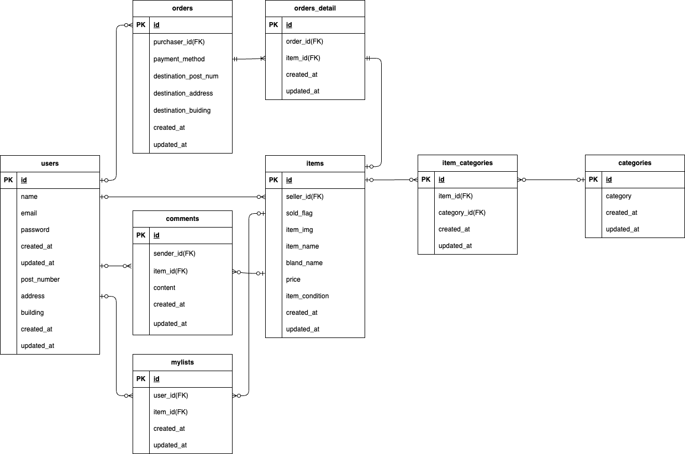

#coachtechフリマ

##環境構築 
Dockerビルド  
    1.git clone git@github.com:coachtech-material/laravel-docker-template.git  
    2.docker-composer.ymlのmysqlイメージにplatform: linux/amd64を追記  
    3.docker-compose up -d --build  

Laravel環境構築  
    1.docker-compose exec php bash  
    2.composer install  
    3..env.exampleから.envを作成、環境変数を変更  
    4.php artisan key:generate  
    5.composer require laravel/fortify  
    6.php artisan vendor:publish   --provider="Laravel\Fortify\FortifyServiceProvider"  
    7.php artisan storage:link  
    8.php artisan migrate  
    9.php artisan db:seed  

##使用技術  
    ・PHP 7.4.9  
    ・Laravel 8.83.8  
    ・MySQL 8.0.26  
    ・Fortify 1.19.1  

##ER図  
      
##URL  
    ・開発環境:http://localhost/  
    ・phpMyAdmin:http://localhost:8080/  